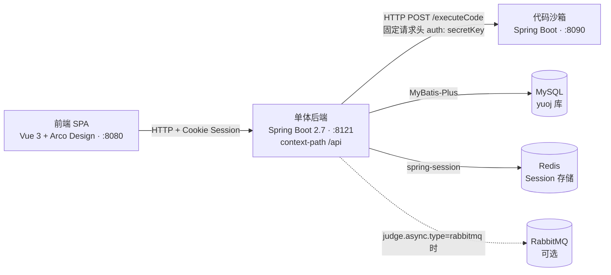
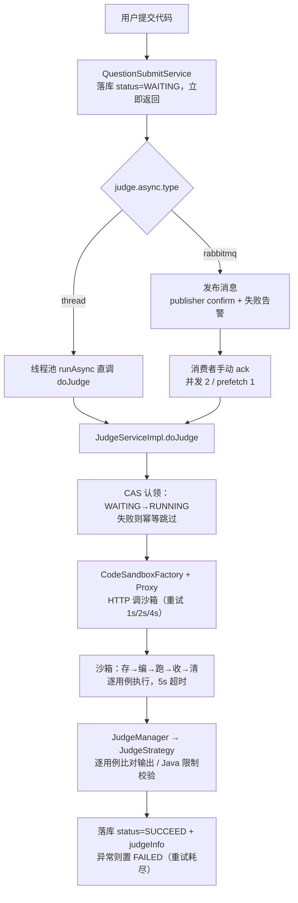

# shanxi-OJ · YuOJ 在线评测系统

> 基于「程序员鱼皮」YuOJ 教程项目改造的在线判题（Online Judge）系统。前后端分离 + 独立代码沙箱服务，三个进程可独立开发、部署与扩展，适合作为 Java / Vue 全栈学习项目。

用户注册登录后浏览题目，在线编写并提交代码；后端将提交异步送入判题链路，经独立沙箱编译执行用户程序，再按判题用例比对输出、回写判题状态与结果。

---

## 功能特性

- **用户体系**：注册 / 登录 / 登出，密码 MD5+盐存储，登录态基于 Redis Session（30 天）；三级角色 `notLogin < user < admin`，接口鉴权走 `@AuthCheck` 注解 + AOP
- **题目管理**：管理员创建 / 编辑 / 删除题目，Markdown 题面，判题用例（`judgeCase`）与时间 / 内存限制（`judgeConfig`）以 JSON 存储；支持分页搜索与题目浏览
- **在线判题**：Monaco 编辑器在线提交（目前支持 Java），提交后**立即返回、异步判题**；判题状态机 `WAITING → RUNNING → SUCCEED / FAILED`，结果 JSON 落库
- **判题异步双通道**（`judge.async.type` 一键切换）：`thread` —— JVM 线程池直调判题；`rabbitmq` —— RabbitMQ 队列投递，publisher confirm + 手动 ack + 死信队列 + 卡死任务定时恢复
- **判题可靠性**：CAS 条件更新（仅 `WAITING → RUNNING`）保证幂等认领；沙箱调用失败按 1s/2s/4s 指数重试；`SubmitStuckRecoveryTask` 每 5 分钟扫描一次，等待中 / 判题中超过 30 分钟的卡死提交分别重新触发判题 / 条件置为失败
- **判题策略扩展点**：`JudgeContext` + `JudgeStrategy`，Java 语言走 `JavaLanguageJudgeStrategy`（含 JVM 启动时间补偿与资源限制校验），新增语言只需新增策略类
- **题目通过率统计**：提交 / 通过原子自增、判题失败兜底回滚与每日校准任务
- **沙箱模板方法**：独立沙箱服务封装「存 → 编 → 跑 → 收 → 清」五步流程，native（宿主机执行，默认）与 Docker（容器执行，预留）两种实现

## 系统架构



通信约定：

- 前端 → 后端：`HTTP + Cookie Session`（axios 全局 `withCredentials`），后端地址在 `src/main.ts` 的 `OpenAPI.BASE` 配置（默认 `http://localhost:8121`）
- 后端 → 沙箱：`HTTP POST /executeCode` + 共享密钥请求头 `auth: secretKey`（两端代码内一致，改动任一端必须同步另一端）
- 后端与沙箱以 JSON 契约（`ExecuteCodeRequest / ExecuteCodeResponse`）解耦，沙箱可独立部署、水平扩展

## 目录结构

> 注意：三个模块目录均为**双层同名嵌套**（如 `oj-backend-master/oj-backend-master/`）。

```
shanxi-OJ/
├── oj-backend-master/
│   └── oj-backend-master/          # 单体后端（Spring Boot，:8121，包名 com.yupi.yuoj）
│       ├── sql/create_table.sql    # 建表脚本（user / question / question_submit）
│       └── src/main/resources/application.yml.example   # 配置模板（含真实口令需自行复制填写）
├── oj-code-sandbox-master/
│   └── oj-code-sandbox-master/     # 代码沙箱（Spring Boot，:8090，包名 com.yupi.yuojcodesandbox）
├── oj-frontend-master/
│   └── yuoj-frontend-master/       # 前端（Vue CLI 5 + Vue 3 + TS，:8080）
├── openspec/                       # OpenSpec 能力规格与变更档案（见下文「规格文档」）
├── AGENTS.md                       # 仓库约定（架构 / 命令 / 约定 / 常见坑）
└── README.md
```

## 技术栈

| 模块 | 技术栈 |
|---|---|
| 单体后端 | Java 8 · Spring Boot 2.7.2 · MyBatis-Plus 3.5.2 · spring-session-data-redis · spring-boot-starter-amqp · Spring Retry · knife4j（接口文档）· hutool / gson · MySQL / Redis |
| 代码沙箱 | Java 8 · Spring Boot 2.7.14 · hutool · docker-java（容器模式依赖，当前未启用）|
| 前端 | Vue 3.2 + TypeScript · Vue CLI 5（webpack）· Arco Design · Vuex 4 · vue-router 4 · Monaco Editor · bytemd（Markdown）· axios + openapi-typescript-codegen |

## 快速开始

### 环境依赖

| 依赖 | 版本 / 说明 |
|---|---|
| JDK | **必须 8**（本仓库基于 Java 8 与旧版 Lombok 编译，更高版本 JDK 会报 `JCTree$JCImport` 编译错误）|
| MySQL | 5.7 / 8.x，本地库名 `yuoj` |
| Redis | 后端 Session 存储，必须可用 |
| Node.js | 前端构建（Vue CLI 5）|
| RabbitMQ | **可选**，仅当切换 `judge.async.type=rabbitmq` 时需要 |

### 1. 初始化数据库

```bash
# 建库后执行建表脚本（注意 utf8mb4 字符集）
mysql -uroot -p -e "create database if not exists yuoj default character set utf8mb4;"
mysql -uroot -p yuoj < oj-backend-master/oj-backend-master/sql/create_table.sql
```

### 2. 配置并启动后端（:8121）

后端、沙箱的 `application.yml` / `application-*.yml` **均不入库**，需从同级 `*.example` 模板复制并填入真实口令（模板内口令统一为 `changeme`）：

```bash
cd oj-backend-master/oj-backend-master
# 复制配置模板并修改 MySQL / Redis 口令（Windows: copy application.yml.example application.yml）
cp src/main/resources/application.yml.example src/main/resources/application.yml
```

启动（Windows 用 `mvnw.cmd`，Unix 用 `./mvnw`）：

```bash
./mvnw spring-boot:run
```

启动后接口文档（knife4j）：<http://localhost:8121/api/doc.html>

### 3. 配置并启动代码沙箱（:8090）

```bash
cd oj-code-sandbox-master/oj-code-sandbox-master
cp src/main/resources/application.yml.example src/main/resources/application.yml   # 仅端口配置
./mvnw spring-boot:run
```

沙箱 native 模式要求宿主机具备 `javac` / `java` 命令且**版本一致**（把同一 JDK8 的 bin 前置到沙箱进程的 PATH，否则会出现 `UnsupportedClassVersionError`）。沙箱运行时会在 `tmpCode/` 目录临时存放用户代码并自动清理。

> 想先不启动沙箱快速体验判题？把后端配置的 `codesandbox.type` 改为 `example`（本地内置示例沙箱，不发起 HTTP）。

### 4. 启动前端（:8080）

```bash
cd oj-frontend-master/yuoj-frontend-master
npm install        # 或 yarn install
npm run serve      # 或 yarn serve，访问 http://localhost:8080
```

前端 `generated/` 目录是 openapi-typescript-codegen 从后端 Swagger 自动生成的客户端，**不要手改**。后端接口变更后重新生成：

```bash
npx openapi --input http://localhost:8121/api/v2/api-docs --output ./generated --client axios
```

### 5. 验证

浏览器打开 <http://localhost:8080>，注册账号并登录 → 进入某道题 → 编写代码提交 → 刷新提交记录查看判题状态与结果（成功 / 失败 / 超时 / 内存超限等）。

## 关键配置速查（后端 `application.yml`）

| 配置项 | 取值 | 说明 |
|---|---|---|
| `judge.async.type` | `thread`（默认）/ `rabbitmq` | 判题异步触发通道；rabbitmq 模式需配置 `spring.rabbitmq.*` 且 broker 可用 |
| `codesandbox.type` | `example` / `remote`（默认）/ `thirdParty` | 后端判题调用的沙箱实现；`remote` 即 HTTP 调本仓库 :8090 沙箱 |
| `codesandbox.http-connect-timeout` / `http-read-timeout` | 毫秒 | 调远程沙箱超时，read 需大于题目最大执行时限 |
| `spring.datasource.*` / `spring.redis.*` | — | 从 `application.yml.example` 复制后填写真实口令 |
| `spring.rabbitmq.*` | — | rabbitmq 通道：手动 ack、并发 2、prefetch 1，死信进 `yuoj.judge.dlq` 人工处置 |

判题链路兜底：后端 `job/SubmitStuckRecoveryTask` 每 5 分钟扫描一次——等待中超过 30 分钟的提交经当前通道重新触发判题（覆盖消息丢失场景），判题中超过 30 分钟的提交通过 CAS 条件更新置为失败（不覆盖已完成结果）。阈值统一用 MySQL `NOW()` 计算，避免 JDBC UTC 时区造成 8 小时错位。

## 判题执行流程



## 规格文档

- [AGENTS.md](./AGENTS.md) — 仓库约定（模块结构 / 常用命令 / 配置与环境 / 代码约定 / 常见坑）
- [openspec/specs/backend/judge-async/spec.md](./openspec/specs/backend/judge-async/spec.md) — 判题异步能力规格（双通道、可靠投递与卡死恢复）
- [openspec/specs/backend/question-acceptance-rate/spec.md](./openspec/specs/backend/question-acceptance-rate/spec.md) — 题目通过率能力规格
- [openspec/specs/frontend/judge-status-display/spec.md](./openspec/specs/frontend/judge-status-display/spec.md) — 判题状态展示（前端）能力规格
- [oj-backend-master/jmeter/README.md](./oj-backend-master/jmeter/README.md) — JMeter 压测脚本说明
- [oj-frontend-master/yuoj-frontend-master/README.md](./oj-frontend-master/yuoj-frontend-master/README.md) — 前端工程 README

新功能 / 较大改动按 OpenSpec 流程推进（`openspec/changes/` 与 `.zcode/` 内的 `opsx` 命令）；本地分析 / 设计文档（`ANALYSIS.md`、`TECH_DESIGN.md`、`CLEANUP.md`）不入库。

## 安全与部署提醒

本项目定位为**教学 / 学习项目**，请勿携带真实口令或直接部署到公网：

- 配置文件中的口令均为 `changeme` 示例值，真实口令请勿提交入库；
- 沙箱 **native 模式**仅在宿主 JVM 子进程中运行用户代码（`-Xmx256m` + 5s 超时），**无文件系统 / 网络隔离**——不要把不受信任的代码投喂到公网暴露的 native 沙箱；生产应切换 Docker 容器执行模式或更强的隔离方案；
- 代码沙箱模块内的 `unsafe/` 包是**故意编写的恶意 / 逃逸测试代码**（读文件、写文件、内存溢出等，用于验证沙箱安全性），请勿删除，也不要将它们作为业务代码运行；
- 本项目代码会先在 `tmpCode/` 存放用户代码、`target/` 存放构建产物，均已被 `.gitignore` 排除，请勿提交。

## 致谢

本仓库基于 [程序员鱼皮（liyupi）](https://github.com/liyupi) 的 [YuOJ 教程项目](https://github.com/liyupi/yuoj)（源码文件头保留 `@author liyupi` 注释）改造，在其基础上进行了代码清理、判题异步可靠性与通过率统计等增强，供学习交流使用。
