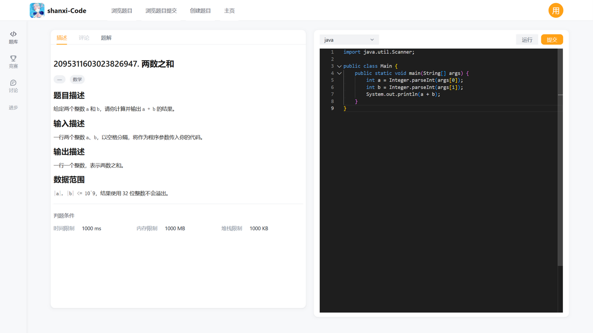
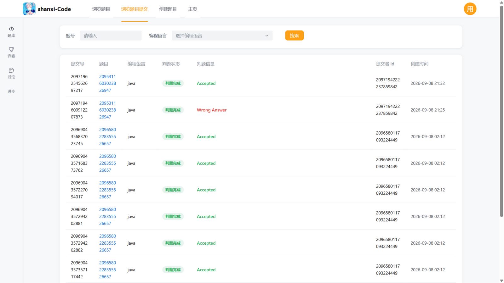
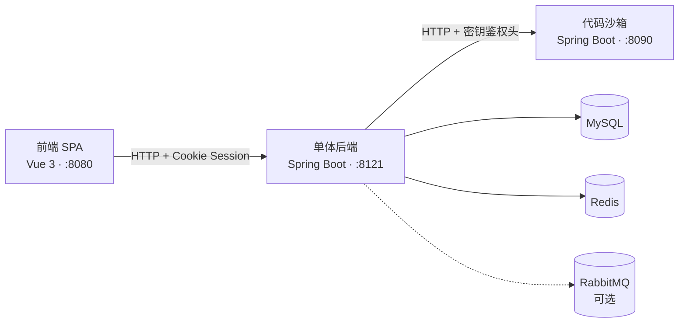

<div align="center">
  

# shanxi-OJ 在线评测系统

**前后端分离 + 独立代码沙箱的在线判题（Online Judge）系统**

<a href="https://www.java.com/"></a>
<a href="https://spring.io/projects/spring-boot"></a>
<a href="https://vuejs.org/"></a>
<a href="https://www.typescriptlang.org/"></a>
<a href="https://www.mysql.com/"></a>
<a href="https://redis.io/"></a>
<a href="https://www.rabbitmq.com/"></a>

</div>

用户注册登录后浏览题目，在线编写并提交代码；系统将提交异步送入判题链路，经独立沙箱编译运行用户程序，再按判题用例比对输出、回写判题状态与结果。

## ✨ 功能实现

**用户体系**

- 注册 / 登录 / 登出，密码加盐 MD5 存储，登录态为 Redis 分布式 Session（30 天有效）
- 三级权限控制（未登录 / 普通用户 / 管理员），`@AuthCheck` 注解 + AOP 切面统一鉴权，前端路由守卫与菜单同步过滤

**题目与判题**

- 题目管理：Markdown 题面与标签编辑，判题用例、时间 / 内存 / 堆栈限制以 JSON 配置，支持分页搜索
- 在线做题：Monaco 编辑器编写代码，提交后立即返回、异步判题，状态机 `等待中 → 判题中 → 判题完成 / 判题失败`
- 多语言判题策略：按语言路由到对应策略实现（Java 策略含 JVM 启动时间补偿与资源限制校验），新增语言只需新增策略类

**判题链路（可靠性设计）**

- 提交落库后经异步通道触发判题，通道一键切换：`thread`（JVM 线程池）或 `rabbitmq`（手动 ack + 死信队列）
- CAS 条件更新认领判题任务，重复投递、并发消费场景下幂等
- 沙箱调用失败按 1s / 2s / 4s 指数退避重试，重试耗尽进入失败终态
- 定时任务每 5 分钟兜底：等待中或判题中超过 30 分钟的卡死提交，分别重新触发判题 / 条件置为失败
- 题目提交数与通过数原子自增，通过率统计由每日校准任务对账

## 🖼️ 效果展示

**在线做题** —— Markdown 题面 + Monaco 编辑器：



**判题结果** —— 提交记录与判题信息实时可查：



## 🏗️ 系统架构



- 前端通过 OpenAPI 生成的类型化客户端与后端交互，登录态基于 Cookie Session（Redis 存储）
- 后端是业务与判题编排中枢：提交先落库再异步触发判题，判题域由工厂、代理、策略模式组合而成，沙箱实现按配置切换
- 沙箱是独立无状态服务，负责编译并运行用户代码，与后端以 JSON 契约 + 共享密钥头通信，可独立部署、水平扩展

## 🛠️ 技术栈

| 技术 | 版本 | 说明 |
|------|------|------|
| Java | 8 | 开发语言 |
| Spring Boot | 2.7.x | 应用框架（后端 / 沙箱） |
| MyBatis-Plus | 3.5.x | ORM 框架 |
| Spring AMQP | - | RabbitMQ 消息通道 |
| Spring Retry | - | 失败重试 |
| Spring Session | - | 分布式 Session |
| knife4j | 3.x | 接口文档 |
| Vue | 3.x | 前端框架 |
| TypeScript | 4.x | 前端开发语言 |
| Arco Design | 2.x | UI 组件库 |
| Monaco Editor | 0.x | 代码编辑器 |
| bytemd | 1.x | Markdown 编辑 / 渲染 |
| MySQL | 8 | 业务数据库 |
| Redis | 7 | Session 存储 |
| RabbitMQ | 4 | 判题消息队列 |

## 📦 核心模块

```
shanxi-OJ/
├── oj-backend-master/oj-backend-master/            # 单体后端 :8121（com.yupi.yuoj）
│   ├── sql/create_table.sql                        # 建表脚本
│   └── src/main/java/com/yupi/yuoj/
│       ├── controller/                             # 用户 / 题目 / 提交接口
│       ├── service/impl/                           # 业务逻辑：提交落库、异步触发判题 ⭐
│       ├── judge/                                  # 判题域 ⭐
│       │   ├── codesandbox/                        #   沙箱工厂 / 静态代理 / example·remote·thirdParty 实现
│       │   └── strategy/                           #   判题策略（Java 语言策略 / 默认策略）
│       ├── mq/                                     # 判题异步通道：thread / rabbitmq 可切换 ⭐
│       ├── job/                                    # 定时任务：卡死提交恢复、通过率校准
│       ├── aop/ + annotation/                      # @AuthCheck 鉴权切面
│       └── model/                                  # dto / entity / vo / enums
├── oj-code-sandbox-master/oj-code-sandbox-master/  # 代码沙箱 :8090（com.yupi.yuojcodesandbox）
│   └── src/main/java/com/yupi/yuojcodesandbox/
│       ├── JavaCodeSandboxTemplate.java            # 模板方法：存→编→跑→收→清 ⭐
│       ├── JavaNativeCodeSandbox.java              # 宿主机 JVM 子进程执行（默认）⭐
│       ├── JavaDockerCodeSandbox.java              # Docker 容器执行（预留）
│       ├── controller/MainController.java          # POST /executeCode + 密钥头校验
│       └── unsafe/                                 # 恶意代码样例（沙箱安全测试用，勿删）
└── oj-frontend-master/yuoj-frontend-master/        # 前端 :8080（Vue 3 + TS）
    └── src/
        ├── views/question/                         # 题目列表 / 做题页 / 提交记录 / 题目管理
        ├── components/CodeEditor.vue               # Monaco 编辑器封装 ⭐
        ├── generated/                              # OpenAPI 自动生成的 API 客户端（勿手改）
        ├── access/                                 # 权限模型 + 全局路由守卫
        └── store/                                  # Vuex（登录用户状态）
```

## 🚀 快速开始

前置依赖：JDK 8（必须，更高版本无法编译本项目）、MySQL、Redis、Node.js；判题切换 RabbitMQ 通道时另需 RabbitMQ。

```bash
# 1. 初始化数据库
mysql -uroot -p -e "create database if not exists yuoj default character set utf8mb4"
mysql -uroot -p yuoj < oj-backend-master/oj-backend-master/sql/create_table.sql

# 2. 启动后端（:8121）——先从 application.yml.example 复制配置并填入数据库口令（Windows 下用 mvnw.cmd）
cd oj-backend-master/oj-backend-master && mvnw spring-boot:run

# 3. 启动代码沙箱（:8090）
cd oj-code-sandbox-master/oj-code-sandbox-master && mvnw spring-boot:run

# 4. 启动前端（:8080）
cd oj-frontend-master/yuoj-frontend-master && npm install && npm run serve
```

打开 <http://localhost:8080>，注册账号即可开始刷题。
